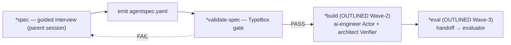

# mutagent-agentspec

The **ADL ① SPEC** stage. Invoke this skill to specify a new agent — run a guided interview that
captures *what the agent IS* and emit a portable, validated `agentspec.yaml`. The spec is the
**Definition** (the interface); a later `*build` implements it into a target.

## §0 — Setup Detection (ALWAYS runs first)

> **The parent session IS the domain orchestrator.** Run the interview yourself — do **NOT** dispatch
> a coordinator sub-agent. AskUserQuestion (and therefore the interview) cannot run inside a
> sub-agent (PR-006). Sub-agents are only dispatched for `*build` (Wave-2), never for `*spec`.

**Lean install:** `pnpx @mutagent/agentspec init` installs the skill AND its two sub-agent contracts
in one step. There is no onboarding config to fill in this wave — `*spec` reads from the operator
interactively, so "setup complete" simply means the skill tree is installed.

```typescript
// PSEUDOCODE — actual execution is agent-native
const setup = await Bash("bash scripts/cli/run.sh scripts/setup/detect.ts");
if (!setup.complete) {
  // skill tree incomplete → reinstall: pnpx @mutagent/agentspec init
} else {
  // → load references/workflows/orchestrator-protocol.md and follow inline.
  //   The parent session runs the *spec interview. DO NOT dispatch a coordinator.
}
```

## §0.1 — Star-commands

These are THIS skill's `*command` semantic map. Resolution is governed by the verbatim contract at
the bottom of this section.

| Command | Kind | Owner | Binds | Purpose |
|---|---|---|---|---|
| `*spec` | hybrid | own (full) | `references/workflows/orchestrator-protocol.md` | Guided parent-session interview → emits + validates `agentspec.yaml` (the Definition + Build + Appendix). |
| `*spec-from-impl` | hybrid | own (full) | `references/workflows/orchestrator-protocol.md#spec-from-impl--brownfield-reverse-generate-a-spec-from-an-existing-implementation` | BROWNFIELD (F10): adopt an EXISTING implementation — read the impl + its env/integration surface → reverse-generate a draft `agentspec.yaml` (operator confirms inferred fields) → validate. Subject-agnostic; no per-connector logic. |
| `*validate-spec` | script | own | `scripts/validate/validate-spec.ts` | TypeBox round-trip schema gate over a spec file (`agentspec.v0.2.0`). |
| `*build` | hybrid | own (OUTLINED this wave) | `references/workflows/orchestrator-protocol.md#build` + `assets/agents/*` | Implement the spec into the target (framework or harness) + a TDD loop. Dispatches the two SHIPPED sub-agents. |
| `*eval` | agent-chain | route → evaluator (OUTLINED) | `references/workflows/orchestrator-protocol.md#eval` | Hand the built agent + its `evals.success_criteria` to an evaluator for eval-driven development (phased). |

### Star-command resolution contract (verbatim)

When you encounter a `*<name>` token:
1. **RESERVED** — `*` marks a command. NOT prose, NOT a file path, NOT an external shortcut. Never improvise.
2. **RESOLVE** — look up `<name>` in the table above. Not found ⇒ ERROR + ask the operator. NEVER guess.
3. **BINDING** — read `Kind` + `Binds`:
   - `script` ⇒ CALL the bound script via `scripts/cli/run.sh`. Do NOT re-implement it in prose.
   - `agent-chain` ⇒ load + run the bound workflow steps in order.
   - `hybrid` ⇒ call script(s) for deterministic parts, reason for the rest.
4. **PRE-GATE** — load any pre-gate references the bound workflow declares.
5. **EXECUTE** — run the steps IN ORDER. Invent nothing.
6. `Purpose` explains WHY (not executed). Steps MAY reference other `*commands` (composition).

## §1 — Triggers

This skill activates on any of:
- `mutagent-agentspec` · `/mutagent-agentspec`
- `*spec` · `spec` · `specify the agent` · `plan a new agent` · `define an agent` · `new agent spec`
- `*spec-from-impl` · `spec from impl` · `reverse-generate a spec` · `adopt an existing agent` · `spec an existing implementation`
- `pnpx @mutagent/agentspec init`

## §2 — Quick start

```bash
# 1. install (project-local by default; --global for the home dir)
pnpx @mutagent/agentspec init

# 2. inside your coding agent
/mutagent-agentspec        # load the skill
*spec                      # run the guided interview → agentspec.yaml
*validate-spec ./agentspec.yaml   # schema-gate it (round-trip)
```

Start from the worked example: `assets/templates/agentspec.yaml.tpl` (a complete, validated
synthetic spec exercising every field).

## §3 — Architecture



- **`*spec`** is full + parent-session-driven (the interview). **`*validate-spec`** is the schema gate.
- **`*build`** + **`*eval`** are OUTLINED this wave (protocol prose + the two shipped sub-agent
  contracts); the full loops land in later waves (lean by design — ship `*spec` first).

## §4 — Bill of materials

| Surface | Path |
|---|---|
| The `agentspec.v0.2.0` schema (TypeBox) | `scripts/contract/agentspec.schema.ts` |
| The schema gate | `scripts/validate/validate-spec.ts` |
| The interview FSM (+ build/eval outlines) | `references/workflows/orchestrator-protocol.md` |
| Operative principles (PR-NNN) | `references/principles.md` |
| Requirements hub (REQ-NNN) | `references/requirements.yaml` |
| Pinned framework docs | `references/frameworks/doc-pins.md` |
| Worked example spec | `assets/templates/agentspec.yaml.tpl` |
| `*build` Actor sub-agent | `assets/agents/agentspec-ai-engineer.md` |
| `*build` Verifier sub-agent | `assets/agents/agentspec-architect.md` |
| CLI (install / probe / runner) | `scripts/cli/{init,doctor,run.sh}` · `scripts/setup/detect.ts` |

## §5 — Standalone discipline

Every artifact under `.claude/skills/mutagent-agentspec/` is a sealed unit with ZERO source
reference to any sibling skill — and in particular NONE to the internal skill-construction skill (PR-018). The
`*eval` handoff to an evaluator is a designed feature mentioned at the doc/protocol level only,
never a code import. All dispatched sub-agents are SHIPPED in `assets/agents/*.md` (PR-008) — there
is no dependency on a host `architect` / `developer` / `general-purpose` / `llm-whisperer` agent.
