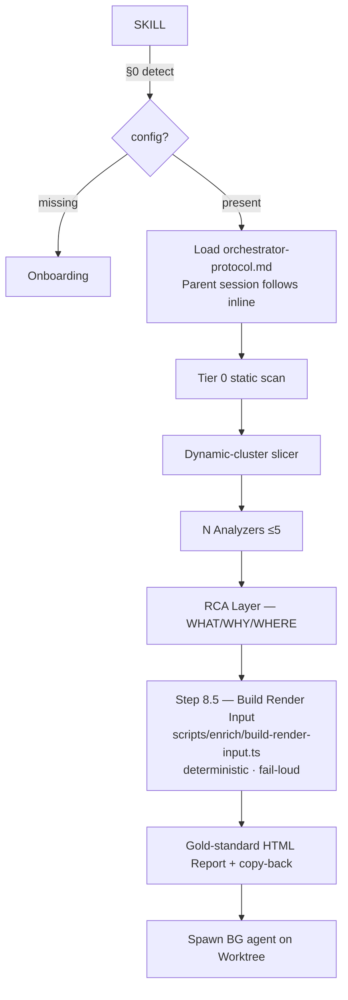

# mutagent-diagnostics

Diagnostics-on-Tap for AI agents. Invoke this skill to run a full diagnostic cycle on your agent traces.

## §0 — Setup Detection (ALWAYS runs first)

> **CWD matters.** `detect.ts` (and every other `scripts/cli/run.sh`-dispatched
> script) MUST be invoked from the operator's PROJECT ROOT, NOT from inside the
> skill install path. `detect.ts` defensively rejects invocations from any path
> containing `.claude/skills/` to avoid mis-detecting the skill's own
> `.mutagent-diagnostics/` as the operator's project config. Use absolute paths
> in the `Bash()` call if your shell is anywhere else.

**Lean install (W9-10):** `pnpx @mutagent/diagnostics init` installs the skill AND
its sub-agents in one step. Onboarding (`references/workflows/onboarding.md`)
configures **platforms only** — agent install is NOT a mandatory onboarding step.
Onboarding checks whether agents are present (skip-if-present) and offers install
only if missing — it never mandates or auto-installs them. Agents already present
→ silently skipped.

```typescript
// PSEUDOCODE — actual execution is agent-native
const config = await Bash("bun scripts/cli/run.sh scripts/setup/detect.ts");
if (!config.complete) {
  // → Onboarding branch (references/workflows/onboarding.md)
} else {
  // → Diagnostics: load orchestrator-protocol.md and follow inline
  // DO NOT dispatch a coordinator sub-agent (operator voice-stamp T1)
}
```

Load `references/workflows/onboarding.md` if config missing or `--reconfigure` flag present.

**Source-platform CLI gate (onboarding, PR-021):** source platforms (Langfuse,
Codex, …) are usually driven via a CLI, and most clients will NOT have it
installed. During onboarding the skill (a) links the platform's **official CLI
docs** and (b) when the CLI is missing, **offers an install that the user must
explicitly approve first — it NEVER auto-installs**. The reusable
`ensure-cli(platform)` helper (`scripts/setup/ensure-cli.ts` →
`scripts/cli/init.ts` `ensureSourceCli`) probes PATH, shows docs + the install
command, then gates the install behind the platform-portable ASK (AskUserQuestion
on Claude Code; chat y/N fallback elsewhere). On decline → REST/file fallback +
record CLI absent. File-only / backend-specific sources (local-jsonl, claude-code,
otel) report `not-required` — nothing to install. See
`references/workflows/onboarding.md` Phase 2.

If config complete: load `references/workflows/orchestrator-protocol.md` and follow inline.
**Do NOT dispatch a coordinator sub-agent.** The parent session IS the orchestrator.
(Reason: sub-agents cannot dispatch other sub-agents or invoke AskUserQuestion — operator T1.)

### §0.1 — Star-commands (W9-05)

`*command` tokens are this skill's internal semantic map. `@shortcut` tokens are the
architech resolver (external). Never mix them.

**Resolution contract:** when you encounter a `*<name>` token, look it up in the
`commands:` table below. `kind: script` → call the bound script. `kind: agent-chain`
→ load the bound workflow file/section and run steps in order. `kind: hybrid` → call
script(s) for deterministic parts, reason for the rest. NEVER improvise.

| Command | Kind | Binds (relative) | Purpose |
|---------|------|-------------------|---------|
| `*diagnose` | hybrid | `orchestrator-protocol.md#step-1..11` | Full diagnostic pipeline |
| `*normalize-traces` | script | `scripts/normalize/platforms/{platform}.ts` | Deterministic trace normalize — never hand-parse |
| `*library-match` | script | `scripts/library/match.ts` | Best-effort prior consult (de-mandated W9-02; empty library → proceed fresh) |
| `*dispatch-analyzers` | agent-chain | `orchestrator-protocol.md#step-6 + handover-contract.md` | Fan-out ≤5 analyzers via handover contract |
| `*render-report` | script | `scripts/report/render.ts` | Stamp gold-standard HTML — never hand-build |
| `*self-diagnose` | hybrid | `references/internal/self-diagnostics.md` | Diagnose skill's own traces (PR-022) |

Full resolution contract verbatim:
```
When you encounter a *<name> token:
 1. RESERVED — `*` marks a command. NOT prose, NOT a file path, NOT an @shortcut.
      *command = THIS skill's semantic map (internal).  @shortcut = architech resolver (external). Never mixed.
 2. RESOLVE — look up <name> in the `commands:` block. Not found => ERROR + ask. NEVER improvise.
 3. BINDING — read kind: + binds::
      kind: script      => binds: <relative script path>   => CALL the script. Do NOT re-implement in prose.
      kind: agent-chain => binds: <workflow file#section>  => load + run the steps in order.
      kind: hybrid      => binds: both                     => call script(s) for deterministic parts, reason for the rest.
 4. PRE-GATE — load any pre_gate.loads:.
 5. EXECUTE — run compresses:/workflow steps IN ORDER. Invent nothing.
 6. purpose:/impact: explain WHY (not executed). compresses: MAY reference other *commands (composition).
```

## §1 — Triggers

Invoke me with:
- `mutagent-diagnostics` / `diagnose my agents` / `/mutagent-diagnostics`
- `diagnose <agent-name>` / `why did <agent> fail` / `analyze traces`
- `--reconfigure` to re-enter onboarding
- `pnpx @mutagent/diagnostics init` — manual CLI entry point (install + first-time setup)

## §2 — Quick-Start

```bash
pnpx @mutagent/diagnostics init       # first-time: installs skill + runs onboarding
```

After init, invoke naturally in your coding-agent chat.

## §3 — Architecture Overview



Full DAG: `references/reference.md`

### §3.1 — Report shape (Wave-5 gold-standard renderer)

`scripts/report/render.ts` + `assets/templates/report.html.tpl` emit the operator-approved
**gold-standard** report — NOT a generic 4-layer dump. Tab layout:

| Tab | Content |
|-----|---------|
| **Methodology [INTERNAL]** (`t0`) | Mermaid sequence (orchestrator → scripts → analyzers) + graded decision log + signal census. NODE-STRIPPED when `--audience client` (FU-INT-1). |
| **Overview** (`t1`) | Auto-extracted entity card · 6-tile big-stat row (latency p50/p95/max · cost · traces · errors) · headline callout · signal census · scan-coverage funnel · 24h latency heatmap (colour = avg latency, number = trace count) · findings summary table. |
| **F-NNN** (`t2..tN+1`) | One tab per finding — severity-badged story-led title · WHAT/WHY/WHERE taxonomy · Problem · Evidence · Why-chain (origin marker) · **Assumptions block** (verified / unverified / hypothesis-pending pills) · ranked remedies (★ rank-1 = green-glow `.recommended`, pre-checked). |
| **Decisions** (`tdecisions`) | Recommended-bundle callout + general speech-to-text feedback box + copy-decisions markdown export. |

The renderer is **fail-loud (R1 §9.3)**: it REFUSES (throws, non-zero) when ≥3 of the 4 internal
render shapes (`diagnosedEntity` / `bigStat` / `hourlyHeatmap` / `signalCensus`) are missing — no
silent placeholder. Always run the **Step 8.5 enricher** (`scripts/enrich/build-render-input.ts`)
first; never call the renderer on raw findings.

**Rich `EntityContext` at ingest (R1.7):** every source-platform normalizer
(`scripts/normalize/platforms/*.ts`) auto-extracts an `EntityContext` (name · model · system
prompt · tool inventory with per-tool stats · input sample) alongside its `TraceBody[]` —
deterministically, no LLM. The operator never hand-fills the entity card. Any field > 1 KB renders
inside a default-collapsed **`ExpandableSection`** (`<details class="expand">`); the system prompt is
ALWAYS collapsed regardless of size (PII — explicit click to view).

**Self-diagnosis report mode (PR-022/PR-025):** when `config.self_diagnostics.enabled`, the SAME
renderer produces a meta-report — findings cluster-grouped by `failureOrigin.what` (one tab per
cluster), a forced `⚙ SELF-DIAGNOSIS` banner, a skill-typed entity card (built from the skill's own
SKILL.md + `scripts/`), `[INTERNAL]` session prefix, and it REFUSES `--audience client` (self-diag
is always internal). See `references/internal/self-diagnostics.md`.

### §3.2 — Structured contract mode (Wave-4)

When the diagnosed target declares a `self-diagnosis-contract.yaml`, the renderer switches to a
**structured 10-category report** (`renderStructuredReport`) scoring findings against the declared
success criteria (pass / fail / not-applicable / pending). Targets without a contract get the
open-ended gold-standard report unchanged. Schema: `scripts/contract/types.ts`.

## §4 — Bill of Materials (scripts/ — Type A pure scripts)

| Script | Purpose |
|--------|---------|
| `scripts/tier0-scan.ts` | Static pattern scan — route-guess + signal count |
| `scripts/slicer.ts` | Dynamic-cluster slicing, cap-of-5 |
| `scripts/stale-detector.ts` | Hash compare for target freshness |
| `scripts/config/schema.ts` | TypeBox schema — config.yaml source of truth |
| `scripts/config/load.ts` | YAML parse + env-ref resolution |
| `scripts/config/validate.ts` | Schema validation + typed errors |
| `scripts/normalize/trace.ts` | Canonical types: TraceMetadata + TraceBody + Finding + Remedy + `EntityContext` / `SizedText` / `ToolInventoryEntry` / `Assumption` (Wave-5 R1.7/R1.3) |
| `scripts/normalize/platforms/` | Per-platform shape mapping (5 platforms) — each ALSO emits a deterministic `EntityContext` at ingest (Wave-5 R1.7) |
| `scripts/normalize/platforms/entity-context.ts` | Shared deterministic `EntityContext` extractors (system-prompt, tool-inventory, input-sample, majority-vote name) — content-derived, NO LLM (Wave-5 R1.7) |
| `scripts/enrich/build-render-input.ts` | Deterministic enricher — (tier0, slice-plan, findings, metadata) → fully-populated `RenderInput`; aggregates 24h heatmap + big-stat + signal census; fail-loud on starved input (Wave-5 R1.4 — orchestrator Step 8.5) |
| `scripts/report/render.ts` | Renders the gold-standard multi-tab report (Methodology · Overview · one tab per finding · Decisions — tab count is dynamic, N findings → N tabs) from an enriched `RenderInput` (`--findings <p> --output <p> [--template <p>] [--audience client\|internal]`). Fail-loud when ≥3 of 4 internal shapes missing (R1 §9.3) |
| `scripts/report/persist-selections.ts` | Persist operator copy-back selections from the report HITL gate |
| `scripts/contract/types.ts` | TypeBox `SelfDiagnosisContract` schema — opt-in structured 10-category report mode (Wave-4) |
| `scripts/lint/template-inline-js.ts` | R-007-B: Walk `assets/templates/*.html`, reject TypeScript patterns in executable `<script>` blocks |
| `scripts/setup/detect.ts` | Config presence + completeness check; `--cli <plat>` probes a source platform's CLI via `ensure-cli` |
| `scripts/setup/ensure-cli.ts` | Source-platform-general CLI gate (PR-021): per-platform `CLI_SPECS` (binary + install cmd + official docs link), `planCliEnsure` decision (pure — never installs), `runCliInstall` (caller-gated — assumes approval). NEVER auto-installs |
| `scripts/setup/reconfigure.ts` | Re-onboarding handler |
| `scripts/cli/init.ts` | CLI entrypoint + runtime detection; `ensureSourceCli` approve-to-install gate + `--ensure-cli <plat>` mode (platform-portable ASK; install only on explicit approval) |
| `scripts/cli/doctor.ts` | Runtime probe + env validate + JSON health report (`{ runtime, env, version, errors[] }`) |
| `scripts/cli/run.sh` | bun→pnpm→npm fallback selector (fully portable — zero `Bun.*` API surface in scripts/cli/) |
| `scripts/self-diagnostics/probe.ts` | [INTERNAL] Host + session path detector |
| `scripts/self-diagnostics/dispatch.ts` | [INTERNAL] Self-trace → RCA dispatch |

Invoke scripts via: `Bash("scripts/cli/run.sh scripts/<name>.{ts|sh} [args]")`
— `.ts` files: dispatched via bun→pnpm-tsx→npx-tsx fallback chain
— `.sh` files: dispatched via `exec bash` (no TS runtime needed — R-014-A)

### §4.1 — Wave-6 methodology layer (R2.1–R2.6 + D1/D2)

Wave-6 fixes the diagnostic **methodology** (the renderer was already Wave-5 gold).
The methodology layer below is the operative surface; its design rationale is
maintained internally (not shipped).

| Script | Remedy | Purpose |
|--------|--------|---------|
| `scripts/sample/representative.ts` | R2.5 / R2.1 | Shared 4-bucket sampler (worst·median·best·random, 15-floor, worst-weighted) + 4-dim coverage proof (latency·score·temporal·tool-trajectory) + population-bias stats. Per-finding `coverageConfidence` (90/70 → high/med/low), WARN-only, `--accept-low-confidence`. Deterministic (no clock/random). |
| `scripts/sample/caps.ts` | R2.1 / D1 / PR-048 | Multi-cap `{active,value}` + **dip→ramp deep-read**: escalation rungs `50·100·250·500·1000` (50 = cheap DIP first-rung, NOT a hard ceiling), per-tier time `50:300→1000:1800` (hard ceiling 1800s), default ceiling `min(N,1000)`. max-trace + time caps ACTIVE, **cost(10) INACTIVE by default (D1)**. **Operator override:** `computeCeiling(N, override)` / CLI `--max-trace <N>` raises the ceiling ABOVE 1000 ON COMMAND (operator-explicit only, never auto). `enforceCaps` first-to-trip, SKIPS inactive caps; cap → STOP + emit + banner. Clock injected. |
| `scripts/sample/deep-read-gate.ts` | R2.1 | HARD-REFUSE `llmReadCount===0 && !priorSignalsRef`; priors downgrade; `--focus` does NOT exempt; auto-expand decision (<70% coverage). |
| `scripts/awareness/llm-sample.ts` | R2.2 | 5-trace LLM mini-sample BEFORE primary-signal pick (measurement-layer fix; NO severity weights). Fresh-only; SKIP on priors. Deterministic trace selection. |
| `scripts/awareness/blind-spots.ts` | R2.2 | Tier-0-measurable vs blind-spot taxonomy → Methodology Step 1.5 table (Signal·Measurable?·Checked by·Result). |
| `scripts/library/{paths,types,store,match}.ts` | R2.3 / D2 | Class-memory library — INDEX.md + `by-entity/<e>/{journal.md,entity.json,patterns/}`. Approved-only write, 3× prior weight, library-first Tier-0 match, `runs[].operatorInvocation` (D2). **Per-host + gitignored** (`~/.mutagent-diagnostics/library/` — never committed). |
| `scripts/invocation/parse-brief.ts` | R2.6 / W11-06 | Defensive regex parser: NL brief → `{agent?,timeWindow?,focus?,residual,scopeType,entity?}`. Never throws/drops. W11-06: adds `scopeType:'skill'\|'agent'\|null` + `entity` + `focus:` colon form + article guard. |
| `scripts/run/diagnose.ts` | R2.6 / D2 | ⚠️ Zone-1.5 CLI: `/mutagent-diagnostics "<brief>"` single positional arg. Stores verbatim + parsed invocation. No-focus → neutral survey; focus → 🎯 Guided. |

Methodology tab (render.ts) gains: **Step 0** (verbatim operator invocation, D2) ·
**Step 1.5** (awareness layer + blind-spots, R2.2) · **3 widgets** (SVG tier pie,
selection-rule cards, mermaid signal-selection trace, R2.4). Per-finding sampling
**coverage proof** (R2.5) renders below the why-chain. Focus → 🎯 Guided tab REPLACES
Overview (R2.6).

> ⚠️ **Zone 1.5 surfaces (Wave-6):** R2.6 adds the single-arg slash-command CLI;
> D1 changes the caps config to `{active,value}`. See PR description for the diff.

## §5 — Agents (assets/agents/ — Type B agent definitions)

| Agent | Class | Load |
|-------|-------|------|
| `diagnostics-analyzer.md` | pure_subagent_executor | Dispatched by parent session (Step 6 of orchestrator-protocol.md) |
| `diagnostics-apply-worker.md` | pure_subagent_executor, isolation=worktree | Dispatched by parent session at apply gate (Step 11) |

Note: `diagnostics-orchestrator.md` has been retired (P2 pivot). The orchestrator
procedure is now an inline protocol loaded by the parent session
(`references/workflows/orchestrator-protocol.md`). Leaf workers (analyzer + apply-worker)
are still sub-agents since their tool grants are correctly honored by the harness.

## §6 — References (load on demand)

**Start here (first reading):** [`references/overview.md`](references/overview.md) — what the skill does, when to use it, quick-start, and glossary. Link to anatomy doc.

```
references/
  overview.md               # START HERE — What/when/quick-start/glossary (PRD-SO-01)
  reference.md              # Entry point + architecture + dependency graph
  operation-inventory.md    # Type A/B/C classification
  adapter-strategy.md       # Adapter Q1-Q6 locked answers
  filter-search-matrix.md   # Per-platform Filter/Search coverage matrix
  harness-knowledge.md      # Platform Knowledge Table (expandable)
  config.md                 # Schema with doc strings
  workflows/
    onboarding.md           # 8-phase onboarding
    orchestrator-protocol.md # Inline orchestrator protocol (parent session); Step 8.5 builds the render input
    diagnostics.md          # Full diagnostic procedure + NL→filter translation
    apply-dispatch.md       # Apply mechanic (local-agent/local-code-construct/remote)
    apply-pr-comment-format.md # PR-023/PR-030 Diagnostic Apply PR Comment format
    rca.md                  # RCA layer procedure + 3-dim taxonomy
    rendering-anatomy.md    # Canonical per-finding + per-remedy panel anatomy (PRD-CC-12)
    schedule-prep.md        # How to wire scheduling post-v0.1
  source-platforms/         # CLI fetch + filter examples per platform
    langfuse.md             # -> CLI-first explainer + empirical filter-coverage matrix (no native agent-ID; name/tags proxy) + CLI-vs-REST fallback
  target-platforms/         # Apply recipe + hyperlinks per target type
  internal/
    self-diagnostics.md     # [INTERNAL] PR-022 playbook

internal/                   # [INTERNAL] — stripped on publish (.npmignore)
  templates/review/         # Internal dev review templates (Kanban / Audit / skill-overview / brand-shell)
```

**Langfuse source platform:** Langfuse CLIs are the primary way sources/targets
interact with + update trace data (REST as fallback); clients will most often
have the Langfuse CLI installed or Langfuse-as-platform reachable, so the fetch
layer is CLI-first and the skill stays compatible with both surfaces. See
[`references/source-platforms/langfuse.md`](references/source-platforms/langfuse.md)
for the CLI operation manual, the empirical **filter-coverage matrix** (Langfuse
has **no native agent-ID** — `trace.name` + `tags` are the agent proxy), and the
CLI-vs-REST fallback table.

## §7 — Config

Config lives at: `<host>/.mutagent-diagnostics/config.yaml`
Secrets at: `<host>/.mutagentrc` (gitignored, never committed)

Load config: `Bash("scripts/cli/run.sh scripts/config/load.ts")`

Full schema: `references/config.md` and `scripts/config/schema.ts`

Key fields: `source.platform`, `target.platform`, `ask_tool.runtime`, `schedule.mode`, `trigger_rules[]`, `self_diagnostics.enabled`

**W11-07 — Scope + agent-ID identity**: `parse-brief.scopeType` ("skill"|"agent"|null) determines whether the operator named a scope directly (use it) or not (AskUserQuestion picker). `config.agents[]` is an optional cross-platform identity map that resolves a code-level agent name to its Langfuse/OTel identifiers — see `references/workflows/scope-model.md`.

## §8 — Design Principles (55 — operative subset)

Design principles + the decision log that grounds them are maintained internally
(Design/Build artifacts, not shipped). The principles that shape runtime behavior
are operative through the workflows and gates referenced above. Key ones for execution:
- **PR-001**: Tier 0 before LLM — run `scripts/tier0-scan.ts` before any LLM call
- **PR-004**: Branch hygiene — BG worktree + PR; never touch operator's checked-out branch
- **PR-007**: SKILL.md ≤ 500 lines — load references on demand
- **PR-014**: HITL via HTML copy-back primary; AskUserQuestion only for final apply gate
- **PR-019**: Scripts vs agent ops — see operation-inventory.md for classification
- **PR-022**: Self-Diagnostics [INTERNAL] — gated by `self_diagnostics.enabled: false`
- **PR-023**: Clipboard payloads = self-contained actionable plans (v0.3+) — every remedy embeds ActionablePlan; apply PR follows Diagnostic Apply PR Comment format (see `references/workflows/apply-pr-comment-format.md`)
- **PR-024**: Orchestration runs in the parent session, never a coordinator sub-agent
- **PR-025**: Self-diagnosis == client diagnosis — one engine, only the subject differs
- **PR-029**: The report IS the product surface — template-stamp over procedural rendering (the gold-standard `report.html.tpl` + `render.ts` panel functions)
- **PR-033**: Each finding tagged `audience: PRODUCT|META|CORE`; `--audience client` NODE-STRIPs internal nodes
- **PR-035**: Fresh runs MUST LLM-deep-read; caps bound the read, never skip it (`scripts/sample/deep-read-gate.ts` HARD-REFUSES `llmReadCount===0 && !priorSignalsRef`)
- **PR-049**: Primary signal MUST be selected by the reconciled 5-step process (failure-validity gate → impact×prevalence → deep-read corroboration); drives ONE `runMeta.primarySignal` for census·heatmap·funnel (never a frequency artifact)

## §9 — Failure Taxonomy (3 dimensions — v1 locked)

`(WHAT, WHY, WHERE)` — see `references/workflows/rca.md` for full taxonomy and finding shape.

WHAT: `wrong-output`, `missing-output`, `loop`, `latency-spike`, `cost-overshoot`, `format-violation`, `hallucination`, `user-complaint`, `low-score`, `missing-context`

WHY: `prompt-underspec`, `prompt-overspec`, `tool-misuse`, `tool-missing`, `context-overflow`, `provider-limit`, `data-staleness`, `handoff-loss`, `dependency-failure`

WHERE: `system-prompt`, `tool-definition`, `agent-config`, `routing-config`, `upstream-data`, `provider-side`, `harness-side`, `user-input`
