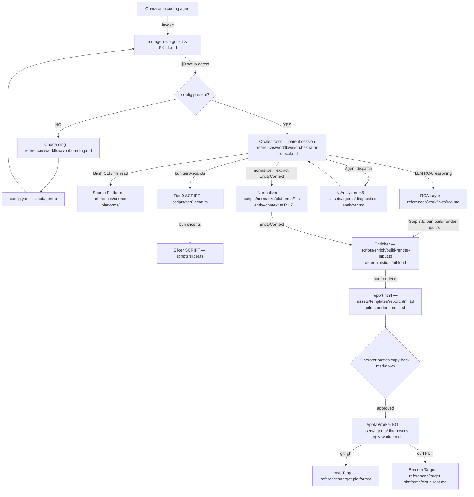
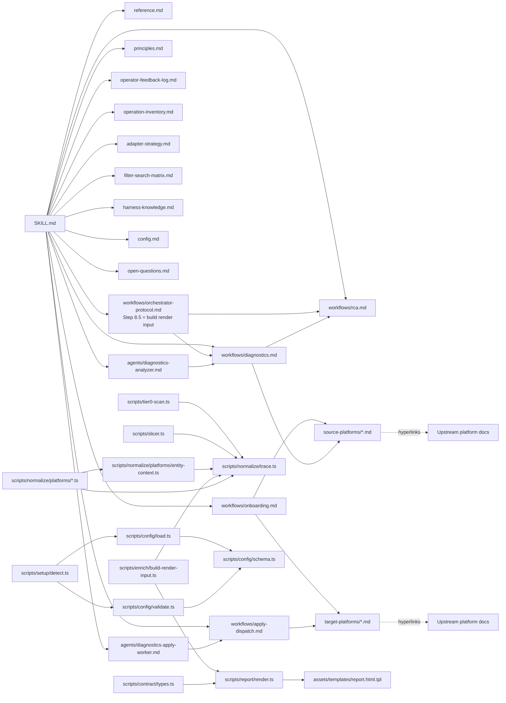

# mutagent-diagnostics — Reference Entry Point

> Load this first. It provides the full architecture diagram, dependency graph, and TOC for all reference docs.

## Architecture DAG

> The Orchestrator is **NOT a sub-agent** — it is the parent coding-agent session following
> `references/workflows/orchestrator-protocol.md` inline (PR-024; the retired
> `diagnostics-orchestrator.md` is archived). The only sub-agents are the leaf workers
> (analyzer + apply-worker).

## Dependency Graph

## Table of Contents

| Reference | Purpose |
|-----------|---------|
| `overview.md` | **Entry point for new users** — What/when/quick-start/glossary (PRD-SO-01) |
| `principles.md` | 53 Design Principles — PR-001 to PR-053 |
| `operator-feedback-log.md` | Append-only operator feedback on the report shape (Wave-5 R1.6) — the durable WHY behind the gold-standard renderer |
| `operation-inventory.md` | Type A/B/C operation classification |
| `adapter-strategy.md` | Adapter Q1-Q6 locked decisions |
| `filter-search-matrix.md` | Per-platform Filter/Search coverage matrix |
| `harness-knowledge.md` | Platform Knowledge Table (expandable) |
| `config.md` | Config schema with doc strings |
| `open-questions.md` | OQ-1..OQ-10 all resolved |
| `workflows/onboarding.md` | 8-phase onboarding procedure |
| `workflows/orchestrator-protocol.md` | Inline orchestrator protocol (parent session); Step 8.5 builds the render input via the enricher |
| `workflows/diagnostics.md` | Full diagnostic procedure + NL→filter |
| `workflows/apply-dispatch.md` | Apply mechanic (local-agent/code-construct/remote) |
| `workflows/rca.md` | RCA layer procedure + 3-dim taxonomy |
| `workflows/verification-methodology.md` | Background Investigator finding false-positive audit (5 tiers + AuditVerdict + per-source cache-detection); on-demand, improvable |
| `workflows/rendering-anatomy.md` | Canonical per-finding + per-remedy panel anatomy (PRD-CC-12) |
| `workflows/schedule-prep.md` | How to wire scheduling post-v0.1 |
| `source-platforms/langfuse.md` | Langfuse CLI fetch + filter examples |
| `source-platforms/otel.md` | OpenTelemetry OTLP pull + queries |
| `source-platforms/local-jsonl.md` | Local JSONL file read patterns |
| `source-platforms/claude-code-transcripts.md` | Claude Code session transcript format |
| `source-platforms/codex-transcripts.md` | Codex session transcript format |
| `target-platforms/local-claude.md` | .claude/agents/*.md apply recipe |
| `target-platforms/local-codex.md` | .codex/agents/*.md apply recipe |
| `target-platforms/local-cursor.md` | Cursor agent dir apply |
| `target-platforms/local-opencode.md` | OpenCode agent dir apply |
| `target-platforms/local-mastra.md` | Mastra code-construct apply |
| `target-platforms/local-cloud-agent-sdk.md` | Cloud Agent SDK apply |
| `target-platforms/cloud-rest.md` | REST PUT with idempotency |
| `internal/self-diagnostics.md` | [INTERNAL] PR-022 self-diagnostics playbook |
