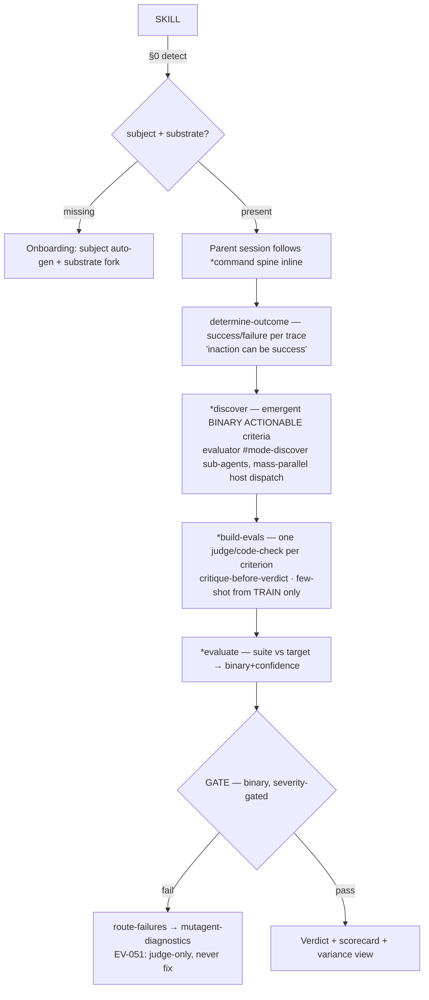

# mutagent-evaluator

Evaluation-development-on-Tap for AI agents/skills. Invoke this skill to build a trustworthy
eval suite for a subject and run it to a GATE verdict.

> **DRAFT — NOT YET PUBLISHED.** Operator tags `evaluator-v*` only after real-run verification.

## §0 — Setup Detection (ALWAYS runs first)

> **CWD matters.** Every `scripts/cli/run.sh`-dispatched script MUST be invoked from the
> operator's PROJECT ROOT, NOT from inside the skill install path. Scripts defensively reject
> invocations from any path containing `.claude/skills/` so the skill never mis-reads its own
> install dir as the subject. Use absolute paths in the `Bash()` call if your shell is elsewhere.

Two things are detected before any eval work:

1. **Subject** (EV-049) — what is being evaluated. The subject profile is AUTO-GENERATED from
   code / platform / trace exploration, **never hand-authored**. `*discover` infers the subject's
   tool inventory + event-type taxonomy by scrolling traces (`observations[].type=="TOOL"`).
   *Worked example:* the sample-email-agent profile is a 35-tool talent-opportunity agent on the
   Vercel AI SDK — inferred, not declared (see sample-findings).
2. **Framework-substrate** (EV-050) — HOW judges run. The **DEFAULT is agent-dispatch**:
   verdicts are produced by parent-session-dispatched `evaluator` (judge / discover modes) leaf
   subagents reasoning on the **HOST runtime** (Claude Code, diagnostics-style MASS-DISPATCH for
   throughput) and read back from verdict FILES — the default path calls NO provider SDK
   (`scripts/agent-dispatch.ts` · `references/workflows/orchestrator-protocol.md`). The other
   onboarding choices remain a real fork: **in-house AI-SDK / LiteLLM judge** (`@langchain/google-genai`
   shape, temp=0, model-intent-sacred) is KEPT but **DEMOTED to OPTIONAL** (a provider-call path
   for CI / code-based export) · **code-based** checks for objective criteria · **user's framework**
   (Vitest / promptfoo / Braintrust) as an EXPORT target. Temperature is pinned 0 on every
   transport (C-PIN); the host's pinned model is the judge under agent-dispatch.

```typescript
// PSEUDOCODE — actual execution is agent-native
const setup = await Bash("scripts/cli/run.sh scripts/profile-subject.ts --detect");
if (!setup.complete) {
  // → Onboarding: subject auto-gen + substrate choice (references/error-analysis.md Step 1)
} else {
  // → Eval-dev: parent session follows the *command spine inline.
  // DO NOT dispatch a coordinator sub-agent — the parent session IS the orchestrator.
}
```

**Do NOT dispatch a coordinator sub-agent.** The parent session orchestrates; only leaf workers
(the `evaluator` cell, any mode) are sub-agents. (Sub-agents cannot dispatch sub-agents or invoke
AskUserQuestion.)

### §0.1 — Star-commands

`*command` tokens are this skill's internal semantic map. `@shortcut` tokens are the architech
resolver (external). Never mix them.

**Resolution contract:** when you encounter a `*<name>` token, look it up in the `commands:`
table below. `kind: script` → call the bound script. `kind: agent-chain` → load the bound
workflow/agent and run steps in order. `kind: hybrid` → call script(s) for deterministic parts,
reason for the rest. NEVER improvise.

> **Default mechanism = agent-dispatch.** `*discover` / `*build-evals` / `*evaluate` run the
> parent-session dispatch FSM in `references/workflows/orchestrator-protocol.md`: PREP
> (`scripts/prep-tasks.ts` → task-spec files) → DISPATCH leaf subagents MASS-PARALLEL on the host
> runtime (they write verdict files) → AGGREGATE (`scripts/run-pipeline.ts` reads the verdict files
> via `scripts/agent-dispatch.ts`). The in-house provider judge is the OPTIONAL substrate fallback.

> **Code/agent hybrid at the command level (GA — mirrors diagnostics).** Each command is a
> DETERMINISTIC SKELETON with an LLM LEAF only where judgement is irreducible — exactly the
> slicer/tier0 (code) + analyzers (LLM) split diagnostics uses. The **code skeleton** owns sample ·
> `resolve-ref` · `lint-grounding` · `diff-discriminate` · aggregate · gate · code-class criteria;
> the **LLM leaf** owns determine · critique · adjudicate · verify · localize · judge-class criteria.
> The split is named per-command in the `code:` / `LLM:` column intent below. **`*evaluate` may now
> return `incomplete`** — the one caller-visible GA delta: a CRIT/HIGH criterion that adjudicated
> indeterminate no longer silently passes (the gate is `fail ▸ incomplete ▸ pass`). See
> `references/grounded-adjudication.md`.

| Command | Kind | Binds (relative) | Purpose |
|---------|------|-------------------|---------|
| `*discover` | hybrid | `references/workflows/orchestrator-protocol.md` + `scripts/prep-tasks.ts` + `scripts/determine-outcome.ts` + `scripts/discover-criteria.ts` + `assets/agents/evaluator.md` (`#mode-discover`) | PREP determiner tasks → fan out `evaluator` (`#mode-discover`, mass-parallel) → AGGREGATE ✓/✗ → mine emergent BINARY ACTIONABLE criteria (EV-041/042/052) **+ T6 failure/uncertain DATASET CANDIDATES** (`collectDatasetCandidates`, reuses the derive-dataset selectors → `*build-dataset`). **GA split** — **code:** sample (broken+healthy) · aggregate · `diff-discriminate` · ground-gate · dataset-candidates; **LLM leaf:** determine + 3 detectors + cite refs + typed assumptions (root-not-symptom). |
| `*build-evals` | hybrid | `references/workflows/orchestrator-protocol.md` + `scripts/eval-engine.ts` + `scripts/codegen-evals.ts` + `scripts/prep-tasks.ts` + `scripts/build-evals.ts` + `assets/agents/evaluator.md` (`#mode-judge-criterion`) + `scripts/render-build-cards.ts` | **ENGINE-FORK FIRST (ADL F7/F9/F14).** ASKS the eval implementation mode via `chooseEvalEngineOptions(target)` — Path A `native-matrix` (eval-matrix + LLM-judge SUB-AGENTS; SURFACES the Claude-Code + log-sink dependency up front) vs Path B `code-written` (`codegen-evals.ts` emits a portable bun/TS suite — runs WITHOUT Claude Code, F14). Target-conditional: a code framework offers BOTH, a `harness:*` target is native-only. **Path A** then PREPs judge tasks (criterion × trace-slice) → fan out `evaluator` (`#mode-judge-criterion`, mass-parallel) → one binary+confidence judge per criterion (EV-043). **GA split** — **code:** engine-resolve · spec render · `lint-grounding` · `resolve-ref` (BIND) · codegen; **LLM leaf:** judge + VERIFY (cite refs · note assumptions · abstain). Streams progress + a verbose evals entity card (F13/F16/F22). |
| `*evaluate` | hybrid | `references/workflows/orchestrator-protocol.md` + `scripts/matrix-judge.ts` + `scripts/contracts/eval-matrix.ts` + `assets/agents/evaluator.md` (`#mode-judge-trajectory`) + `scripts/evaluate.ts` | **DEFAULT (headline):** **T1 TIER-0 deterministic pre-pass** (code-method rows run first, zero judge tokens) → PREP one matrix packet per RESIDUAL judge trajectory (**T5 adaptive-K guard, default 1:1**) → fan out `evaluator` (`#mode-judge-trajectory` — one judge/trajectory scoring the WHOLE matrix, emitting the **T2 Judge DAG v2 walk** = `judge_steps[]` + dense na-explicit map + confidence band + early-INCOMPLETE + node-2.5 candidates) → AGGREGATE: fold code+judge verdicts → **T3 independent verifier** refutes GATING fails (downgrade-only) → **T4 consolidate-by-locus + walk-derived health** → GATE verdict + variance view (EV-048). **GA split** — **code:** tier-0 · prep · `lint-grounding` · `resolve-ref` · `assemble-scorecard` (gate `fail ▸ incomplete ▸ pass`) · consolidate-by-locus · route-failures; **LLM leaf:** trajectory judge (DAG v2 walk: BIND · GROUND[absence-split] · cite · abstain) + independent VERIFY. **MAY now return `incomplete`** (indeterminate → calibrate). **ADL F20:** the rollup ALSO renders a SCORECARD DASHBOARD wireframe (`renderScorecardDashboard` — per-criterion pass/fail bar + variance + samples), not a flat terminal dump. Under a **Path B** engine, `*evaluate` instead runs the portable `codegen-evals.ts` suite (no Claude Code) and reads back its scorecard JSON from the discoverable sink. |
| `*improve` | hybrid | `references/edd-loop.md` + `scripts/edd/variance-gate.ts` + `scripts/edd/change-request.ts` + `scripts/edd/edd-types.ts` + `schemas/edd-change-request.schema.yaml` + `assets/agents/evaluator.md` (`#mode-improve`) | **ADL ③ IMPROVE / EDD loop (F18+F19).** **F19 VARIANCE-FIRST:** repeat-N (default 5) the SAME cases → `evaluateVarianceGate` → accuracy is entered ONLY when the variance gate passes (`assertVarianceStableBeforeAccuracy` THROWS otherwise — "accuracy over big samples is wasted on a flapping verdict"). **F18 CLOSURE:** still JUDGE-ONLY (EV-051), the evaluator emits a grounded `EddChangeRequest` (failing cases + `ref{obs,path,value}` + remedy target `agentspec`\|`impl`) to the `agentspec-ai-engineer` over **SendMessage**, consumes the `ChangeRequestResponse`, and re-evals on `amended`. **Bounded terminator** (`decideEddLoop`, afkloop-legal): `full-green` ▸ DONE \| `max-swings`\|`max-wallclock`\|`no-improvement-streak` ▸ STOPPED + convergence delta. **GA split** — **code:** variance gate · request/response validate · loop terminator (all PURE, injected wall-clock); **LLM leaf:** localize the flap/fail to its root + author the grounded request + decide remedy target. |
| `*validate` | hybrid | `scripts/validate-judge.ts` + `references/validate-evaluator.md` + `assets/agents/evaluator.md` (`#mode-judge-criterion`) | **ENGINED (EV-044)** — calibrate a judge vs `*review` labels: confusion matrix → TPR/TNR · split-disjointness + test-once · Rogan-Gladen θ · deterministic bootstrap CI; `<MIN_LABELS` stays `unvalidated`+bias-corrected. **GA split** — **code:** entire path is deterministic (filter EXCLUDES indeterminate · confusion · RG · assumption-agreement). |
| `*review` | hybrid | `scripts/build-review-ui.ts` + `references/build-review-interface.md` | **ENGINED (EV-045)** — CODE renders a browser annotation UI (one trace/screen · Pass/Fail/Defer · keyboard · auto-save · labels export); **HITL**: a human labels → `mergeLabels` persists → feeds `*validate`. |
| `*eval` | agent-chain | `references/eval-stage.md` + `scripts/eval-engine.ts` + `scripts/materialize-dataset.ts` + `scripts/render-build-cards.ts` | **THE ADL EVAL-STAGE ENTRY (F15).** Called after `*build` hands a freshly-built agent + its agentspec. INTERACTIVELY offers `*build-dataset` / `*build-evals` derived from `agentspec.definition.evals`, and lets the user PICK THE EVAL ENGINE (mutagent native eval-matrix [Path A] vs code-written-in-target-lang [Path B]) via the target-conditional menu (`chooseEvalEngineOptions`). Surfaces Path A's Claude-Code + log-sink dependency UP FRONT (F7/F9). Streams wireframe progress + entity cards (F13/F16/F22). Parent-session only (AskUserQuestion). |
| `*build-dataset` | hybrid | `scripts/materialize-dataset.ts` + `scripts/build-dataset.ts` + `assets/agents/dataset-builder.md` + `schemas/dataset.schema.yaml` + `references/generate-synthetic-data.md` + `scripts/render-build-cards.ts` | **ENGINED (EV-046) + ADL F8.** Now MATERIALIZES real items first: `materializeFromAgentspec` seeds ≥1 REAL DatasetCase per `dataset_category` + one per `edge_case` (seed → actual items, not definitions) → then the 3-way: HITL seed interview (~10) → `dataset-builder` agent (tuples → NL queries → realism filter) → CODE cartesian-expand + near-dup drop + monotonic merge. Streams wireframe progress cards (F13/F16) + a verbose dataset entity card (F22). |
| `*derive-dataset` | script | `scripts/derive-dataset.ts` | **ENGINED (EV-047)** — distill a living regression set from labeled ✓/✗ traces (reuses `sample-traces.ts` EV-052 selectors + `build-dataset.ts` merge). Code-only. |
| `*audit` | agent-chain | `assets/agents/audit-executor.md` + `workflows/{audit,data-leak,variance}.workflow.js` + `scripts/{flow-graph,ui-slots}.ts` + `lenses/context-flow-lens.md` | SURFACES the v1 4-tab static-auditor (EV-001..027, KEEP) **+ now the agent context-flow audit**: tool-result threading + sub-agent handoff completeness (EV-028/029, over the `flow-graph` EV-032 + expected-flow EV-037) and the first-class **HTML-artifact missing-data** dimension (computed-but-not-rendered / orphan / faithfulness, EV-039/040, subject-agnostic). |
| `*self-audit` | hybrid | `scripts/self-audit.ts` + `assets/agents/audit-executor.md` (Mode D) + `references/eval-audit.md` | **EVAL-OF-THE-EVAL (EV-055)** — the evaluator audits its OWN eval-dev artifacts via the eval-audit six-area diagnostic: PREP `self-audit.ts` (deterministic threshold checks over the REUSED `*validate`/`*review`/`*discover`/living-suite outputs → impact-ordered finding DATA) → dispatch `audit-executor` Mode D for the nuanced reads + overall verdict. Reuses `*audit` + `*validate`; rebuilds nothing. **On-demand only** (no cron/monitor/auto-fire). |

Full resolution contract verbatim:
```
When you encounter a *<name> token:
 1. RESERVED — `*` marks a command. NOT prose, NOT a file path, NOT an @shortcut.
      *command = THIS skill's semantic map (internal).  @shortcut = architech resolver (external). Never mixed.
 2. RESOLVE — look up <name> in the `commands:` block. Not found => ERROR + ask. NEVER improvise.
 3. BINDING — read kind: + binds::
      kind: script      => binds: <relative script path>   => CALL the script. Do NOT re-implement in prose.
      kind: agent-chain => binds: <workflow/agent file>    => load + run the steps in order.
      kind: hybrid      => binds: both                     => call script(s) for deterministic parts, reason for the rest.
 4. PRE-GATE — load any pre_gate.loads:.
 5. EXECUTE — run compresses:/workflow steps IN ORDER. Invent nothing.
 6. purpose:/impact: explain WHY (not executed). compresses: MAY reference other *commands (composition).
```

## §1 — Triggers

Invoke me with:
- `evaluate skill <name>` / `evaluate agent <name>` / `/mutagent-evaluator`
- `*discover` (mine criteria) · `build evals for <x>` · `validate judge <x>` · `*audit <subject>`
- `*improve` (the ADL ③ EDD loop — variance-first then request-amend-reeval to full green, bounded)
- `*self-audit` (the eval-of-the-eval — audit my OWN eval-dev; on-demand only)
- borrowed by `mutagent-skill-builder` SIMULATE (SimVerifier role)
- `--reconfigure` to re-enter onboarding (subject + substrate)

## §2 — Quick-Start

Minimal eval-dev spine (build order — do NOT reorder):

```
*discover     → deep-read traces, determine ✓/✗, mine 5-10 binary actionable criteria
*build-evals  → one critique-before-verdict judge (or code-check) per criterion
*evaluate     → run vs target → per-criterion binary+confidence → GATE verdict + variance
*improve      → ADL ③ EDD loop: F19 variance-first (stabilize per-case spread, repeat-N)
                BEFORE accuracy, then F18 closure (judge-only REQUESTS the ai-engineer to
                amend agentspec|impl over SendMessage → re-eval) → full green OR bounded STOP
```

`*validate` (calibrate the judge) and `*audit` (the v1 4-tab static report) layer on top.
`*improve` is the IMPROVE stage — it runs AFTER an initial `*build` + `*evaluate` and is **bounded**
(never infinite): full-green ⇒ DONE; else max-swings / max-wallclock / no-improvement ⇒ STOP + delta.

**ADL EVAL-stage entry (`*eval`).** When `*build` hands over a freshly-built agent +
its agentspec, `*eval` is the entry: it interactively offers `*build-dataset` /
`*build-evals` derived from `agentspec.definition.evals` (F15), MATERIALIZES real
dataset items per category + edge-case (F8), lets the user PICK THE EVAL ENGINE
(Path A native eval-matrix vs Path B code-written — surfacing Path A's Claude-Code +
log-sink dependency up front, F7/F9/F14), streams wireframe progress + entity cards
(F13/F16/F22), and renders the scorecard as a dashboard (F20). See
`references/eval-stage.md` for the full flow + success gates.

**Implemented eval-dev reality (ADL P1–P5, see §4 BoM).** The spine now runs end-to-end on real data:
- **Ingest** — `*discover`/`*evaluate` consume `sources[]`-driven MULTI-SOURCE ingestion (`ingest-sources.ts`, FU-3): a live Langfuse project + local NDJSON exports normalize to one `EvalTrace` stream; secrets are env-var-name refs only.
- **`*discover`** — mines criteria from real leaf verdicts (`aggregate-discover.ts`), maps source topology first (`source-map.ts`), and stamps EVERY criterion with the §5b unified metadata + the §5c **DR-2 discovery rationale** (evidence-first: OBSERVED ⇔ a failure was seen with real refs + honest k/n — never inferred-as-observed). Grows an append-only living suite (saturation-stop). **T6:** also emits failure/uncertain **DATASET CANDIDATES** (`collectDatasetCandidates`) + accepts the `*evaluate` judge's node-2.5 **unmatched-detection handoff** (`unmatchedDetectionCandidates`) → both consumable by `*build-dataset`.
- **Code-before-judge (EX-2)** — the §5b `check_method` routes each metric: `deterministic`→a runnable code-eval the agent executes via Bash (zero judge tokens, byte-identical), `llm-judge`→the host judge, `hybrid`→code pre-filter that gates the judge (`check-method-router.ts` + `code-eval.ts`).
- **`*evaluate`** — the real spine (`run-evaluate.ts`): **T1 tier-0** code-method pre-pass (`tier0Plan` — code rows decided deterministically, only residual judge rows dispatched) → PREP packet (**T5 `adaptivePacketPlan`** overload guard, default 1:1) → dispatch `#mode-judge-trajectory` (emits the **T2 DAG v2 walk**) → fail-loud readiness gate → fold code+judge → **T3 independent verifier** (downgrade-only on gating fails) → **T4 `consolidateByLocus` + `deriveWalkHealth`** → GATE + variance → EV-051 route-to-diagnostics; the masked scorecard is byte-identical across reruns (C-PIN).
- **Report** — terminal eval-cards + the operator-APPROVED 5-tab HTML eval-report (`render-eval-report.ts`): §1 Overview (KPIs · coverage-contract · gating table · top-findings) · §2 Trajectory‖Judge per-trace ledger + click-row Target-Agent‖Judge side-by-side · §3 Eval Scorecard cohort heatmap + nested subcards + inline calibration · §4 Findings verbatim-evidence + judge chain + agree/revise/refute · §5 Self-Eval [INTERNAL, stripped on publish]. `run-evaluate.ts` renders `report.html` post-aggregate; consumes the §9.4 judge-walk (dense na-explicit map + `judge_steps[]`) when present, degrades to the per-trajectory scorecard otherwise.

## §3 — Architecture Overview



**Two foundations.** (1) *Success/failure determination* (EV-042) — the determiner reads the
event + tool trajectory + terminal state and decides goal-attainment; criteria can only be mined
once ✓/✗ labels exist, and real exports usually carry NONE (sample: 0 scores / 0 tags on all
1946 traces). (2) *Judge validation* (EV-043/W2) — a judge is trusted only after it aligns with
human labels. The evaluator is a **reviewer, never an executor**: it never grades a run it
produced, and it never fixes — it routes failures to diagnostics.

### §3.1 — Output shape (verdict + scorecard)

`*evaluate` emits a two-part artifact under `.mutagent-evaluator/{runId}/`:

| Part | Content |
|------|---------|
| **`scorecard.json`** | Per-criterion `{criterionId, class, verdict: pass\|fail\|indeterminate, confidence, critique, refs[], assumptions[], blockedBy?, sourceTraceIds[], severity}` + the rolled-up GATE (`componentPass[]` → `runVerdict`) + the agent-variance block (`scoreVariance` across reruns · `trajectoryVariance` per behavior-tree node). The pinned `judgeModel` + `temperature` are stamped at the top (C-PIN provenance). |
| **verdict report** | Human-readable rollup — headline GATE pass/incomplete/fail, the per-criterion ✓/✗/⏸ table (indeterminate shows its `blockedBy.kind`), the routed-to-diagnostics handoff list (EV-051 failures), the calibration-loop queue (indeterminate criteria), and the validation provenance (TPR/TNR + Rogan-Gladen corrected rate + CI per judge, once `*validate` has run). |

**GA verdict shape (the three new per-criterion fields + the ternary).** Grounded Adjudication
binds every verdict to its evidence (`references/grounded-adjudication.md`):

| Field | Shape | Meaning |
|-------|-------|---------|
| `verdict` | `pass \| fail \| indeterminate` | The **ternary**. `indeterminate` reuses `OutcomeVerdict.Uncertain` (NOT a 4th enum) — the verdict is underdetermined by the inputs, so the judge ABSTAINS. |
| `refs` | `DiscoveryRef[]` = `{obs, path, value}` | STRUCTURED, RE-RESOLVABLE grounding — *where* a value lives (`obs` = trace/observation id, `path` = field path) and the EXACT cited `value` (re-resolved by whitespace-normalized exact match). Replaces prose-only evidence pointers (GA-1 · L2). |
| `assumptions` | `DiscoveryAssumption[]` = `{text, status, kind?}` | TYPED assumptions the judge surfaced. `kind ∈ {factual-intent, normative, scope}`; `status ∈ {hypothesis, unverified, verified, eliminated}` (the calibration lifecycle). `kind` is optional for grandfathered legacy assumptions (GA-3). |
| `blockedBy` | `{kind, text}` | Present iff `verdict === indeterminate` AND the abstain is assumption-driven. `kind` routes the calibration loop: `factual-intent` → re-ground · `normative` → operator-ratify · `scope` → re-scope. Makes the indeterminate ROUTABLE (GA-4). |

**Run-level GATE = `fail ▸ incomplete ▸ pass`** (`RunVerdict`, distinct from the per-criterion
`OutcomeVerdict`). A component is **incomplete** iff a CRIT/HIGH criterion adjudicated
`indeterminate` (and none failed); **fail** iff a CRIT/HIGH criterion failed; **pass** otherwise.
The run takes the worst component state. This is the one intentional GA behavior delta — it kills
the latent **false-green** where a CRIT/HIGH `uncertain` used to silently pass. `*evaluate` may now
return `incomplete`; indeterminate criteria route to the calibration loop, never to the gate.

The scorecard is **deterministic given a pinned judge** — `mask.ts` strips `runId`/timestamps/
abs-paths so two runs on one bundle produce a byte-identical scorecard (the C-PIN invariant the v1
auditor already enforces; the v2 engine inherits it).

**Validation gates trust.** A judge's verdicts are only reported once `*validate` shows TPR/TNR
> 90% on the dev split (test-once on the held-out set); below that the criterion is marked
`unvalidated` in the scorecard and its aggregate rate is bias-corrected (Rogan-Gladen) with a
bootstrap CI rather than reported raw.

## §4 — Bill of Materials (scripts/)

Two engines live in one package: the **NEW v2 eval-development engine** (built by the parallel
engine wave) and the **EXISTING v1 4-tab static-auditor** (~2400L on disk, EV-001..027 already
implemented — surfaced by `*audit`, never rebuilt).

**v2 eval-development engine** (binding contract for the `*command` table above; full TDD gate
applies, EV-053/EQ5):

| Script | Req | Kind | Purpose |
|--------|-----|------|---------|
| `scripts/contracts/eval-types.ts` | — | code | Shared v2 type contracts (TraceLabel · Category · CriterionSpec · JudgeVerdict · Scorecard). |
| `scripts/determine-outcome.ts` | EV-042 | hybrid | Deep-read one trace (event + trajectory + outputs) → binary goal-reached + confidence. **Encodes "inaction can be success"** (a guard-hold is a Pass; never use "called a tool" as a success proxy). |
| `scripts/sample-traces.ts` | EV-052 | code | Balanced ✓/✗ sampling: random + outlier + failure-driven + uncertainty + stratified. Re-implements the diagnostics filtering PATTERN (sealed-sibling: never imports it). |
| `scripts/profile-subject.ts` | EV-049 | hybrid | Auto-gen subject profile from code / platform / trace exploration — never hand-authored. For sample: infer the 35-tool inventory + event taxonomy from `observations[].type=="TOOL"`. |
| `scripts/discover-criteria.ts` | EV-041 | hybrid | Over a labeled ✓/✗ batch: segment + emergent-category clustering → 5-10 binary actionable criteria; saturation stop; **flag fixable-vs-eval-worthy, do NOT fix (EV-051)**. |
| `scripts/build-evals.ts` | EV-043 | hybrid | THE `*build-evals` engine — one binary+confidence judge per criterion (4-component, critique-before-verdict, few-shot from TRAIN split only). The verdict comes from the injected `JudgeInvoke` seam (DEFAULT = agent-dispatch verdict files; in-house provider optional). Borrows the C-PIN judge-call discipline from the v1 `scripts/run-judge.ts` + `scripts/mask.ts` (same package, not sealed-sibling). |
| `scripts/agent-dispatch.ts` | EV-050 | code | **THE DEFAULT judge transport.** Verdict-file-backed `JudgeInvoke` + the PREP/AGGREGATE primitives (`promptHash` content key · `writeJudgeTask` · `createAgentDispatchJudge` · `missingVerdictKeys`). Verdicts come from host-runtime dispatched subagents — NO provider SDK on this path. |
| `scripts/prep-tasks.ts` | EV-050 | code | The deterministic PREP: `prepDeterminerTasks` (stage A) + `prepJudgeTasks` (stage B, replays the pipeline with a capturing judge for byte-identical prompts). Emits task-spec files the parent dispatches. |
| `scripts/evaluate.ts` | EV-048 | hybrid | Run suite vs subject → per-criterion binary+confidence → **GATE** (binary, severity-gated) + **agent-variance view** (EV-054: eval-score variance across reruns + trajectory variance). |
| `scripts/route-failures.ts` | EV-051 | code | Judge-only: emit a diagnostics-handoff bundle for failures (incl. infra-class C4 dead-channel). NEVER fixes. |
| `scripts/substrate.ts` + `scripts/judge-provider.ts` | EV-050 | code | Framework-substrate selection — **DEFAULT agent-dispatch** (host-runtime subagents, no provider) · in-house provider judge (`@langchain/google-genai` shape, OPTIONAL/demoted, lazy import · temp 0 · model = `config.models.default`/`--model` · THROW on missing creds) · code-based · user-framework export. |
| `scripts/validate-judge.ts` | EV-044 | code | **`*validate` stats (W2 — live).** Confusion matrix → TPR/TNR · split-disjointness + test-once guards · Rogan-Gladen θ=(p_obs+TNR−1)/(TPR+TNR−1) (clip + invalid-when denom≈0) · DETERMINISTIC seeded-LCG bootstrap CI (no `Math.random`) · `<MIN_LABELS` → `unvalidated`+bias-corrected. Pure math, no LLM. |
| `scripts/self-audit.ts` | EV-055 | code | **`*self-audit` core (W4 — eval-of-the-eval).** The eval-audit six-area diagnostic as PURE threshold checks over the evaluator's OWN eval-dev artifacts (REUSES `*validate` `ValidationResult[]` · `*review` `HumanLabel[]` · `*discover` `DiscoveredCriterion[]` · living-suite provenance). Emits impact-ordered finding DATA; NO judge prose, NO subjective verdict. The nuanced reads are `audit-executor` Mode D (agent-dispatch). On-demand only. |

**ADL P1–P5 engine extensions** (the implemented eval-dev reality — multi-source ingestion ·
`*discover` metadata + DR-2 · code-track · `*evaluate` spine · reporting; full TDD gate):

| Script | Phase | Kind | Purpose |
|--------|-------|------|---------|
| `scripts/contracts/source-spec.ts` | P1 (FU-3) | code | `SourceSpec` / `SourcesConfig` TypeBox contract + `parseSourcesConfig` (guarded). A source = `{id, kind: langfuse\|local-ndjson, creds_ref (env-var NAME refs only — never raw secrets), path, project, fetch_policy{page_size,concurrency,delay_ms,sample_cap}}`. `config_version` 0.2.0. |
| `scripts/ingest-sources.ts` | P1 (FU-3) | hybrid | Multi-source ingestion → the EXISTING `EvalTrace` shape (no downstream contract change). PURE core `ingestSources(config, fetchers)` (DI fetcher registry, fail-loud on unregistered kind) + effectful `localNdjsonFetcher` + `langfuseFetcher` (global fetch, no SDK, gentle paged fetch_policy, creds resolved from `creds_ref→process.env`, NEVER logged). Reuses the SV-1-tolerant `load-traces.mapRecord`. |
| `scripts/source-map.ts` | P2 (§5a) | code | `buildSourceMap(traces)` → the topology artifact (entity/feature/stage topology + per-stage I/O from GENERATION observations). SV-1 tolerant (null trace-output → GENERATION obs; counts null-output traces). GENERIC — data-derived stages, no client topology. Drives the report's adaptive Findings branch. |
| `scripts/aggregate-discover.ts` | P2 (§5a) + §9.4 (T6) | code | The real `*discover` AGGREGATE half: parse the leaf's per-trace verdict files + per-batch mining report → `TraceAnnotation[]` (FAIL-LOUD via `missingVerdictKeys`; THROW on an undispatched-trace category ref) → `deriveMinedCriteria` (§5b metadata + §5c DR-2) → `growLivingSuite` (append-only, monotonic, saturation-stop). **T6:** `collectDatasetCandidates` (failure/uncertain → `DatasetCase[]` via the derive-dataset selectors) + `unmatchedDetectionCandidates` (the `*evaluate` judge's node-2.5 handoff) → consumable by `*build-dataset`. `DiscoverMiningReport` contract. No hand-rolled annotations. |
| `scripts/code-eval.ts` | P3 (EX-2) | code | The v2 CODE-track primitive library — generic PURE `(trace) → {result, detail}` checks: presence · string-equality · format-validity · schema-conformance · ref-integrity (cross-stage). SV-1 dotted-path read incl. `obs:<name>.<path>`. Exhaustive `runCodeEval` (unknown primitive → THROW). NO LLM, byte-identical. Disjoint from the v1 `run-deterministic.ts` audit world. |
| `scripts/check-method-router.ts` | P3 (EX-2) | hybrid | THE load-bearing §5b `check_method` router: `deterministic`→CODE-EXEC (judge NEVER called) · `llm-judge`→JUDGE seam · `hybrid`→code pre-filter that GATES the judge. Unknown → THROW (exhaustive). `RoutedCriterionVerdict` = `CriterionVerdict` + provenance `{producedBy, codeResult, judgeReached}` (structural superset → `evaluate.ts` rollup unchanged). `extractCodeEval(registry)` fail-loud (a code-class criterion with no spec THROWS — never silently judge). "Code before judge" lives INSIDE the agent. |
| `scripts/run-evaluate.ts` | P5 + §9.4 (T1·T3·T4·T5) | hybrid | The real-engine `*evaluate` end-to-end COMPOSER: `tier0Plan` (T1 — code rows decided in the pre-pass, residual judge rows only in packets) → `prepMatrixPackets` (residual-only) → `adaptivePacketPlan` (T5 overload guard, default 1:1) → [dispatch #mode-judge-trajectory] → `aggregateEvaluate` (FAIL-LOUD readiness gate over DISPATCHED ids → `aggregateMatrixScorecard` folding code+judge + T3 `independentVerify` downgrade-only on gating fails → GATE + variance → T4 `consolidateByLocus` lociClusters → EV-051 `routeFailures`→validated HandoverBundle). `maskedScorecard` = the C-PIN byte-identity artifact. |
| `scripts/render-eval-report.ts` | P4 (D-1/2/3) | code | The v2 reporting (v1 `render-report.ts` untouched): `renderEvalCards` (D-1 terminal per-criterion cards) + `buildEvalReportInput` (derives the rich tabs from real run data — ledger · coverage · cohorts · gating rolls · top-findings · judge-health) + `renderEvalReport` (the operator-APPROVED 5 tabs: ① Overview KPIs+coverage+gating-table+top-findings · ② Trajectory‖Judge ledger + click-row Target-Agent‖Judge side-by-side · ③ Eval Scorecard cohort heatmap + nested subcards + inline calibration · ④ Findings verbatim-evidence + judge chain + agree/revise/refute · ⑤ Self-Eval [INTERNAL, strip-marked]). Consumes the §9.4 judge-walk (`judge_steps[]` + dense map) when present, degrades to the per-trajectory scorecard otherwise. Tabs are `<button>` (no `<s>` strikethrough). Unified design-system tokens (`assets/brand/theme.css`). byte-identical after the `generatedAt` mask. `autoOpenCommand` cross-platform helper (orchestrator fires it). |
| `scripts/contracts/eval-types.ts` *(extended)* | P2/P2b | code | + `MinedCriterion` (additive subtype of `DiscoveredCriterion`) carrying the §5b `MetricMetadata` (generality·dimension·level·check_method [3-value SF-2 router]·substrate·applies_to·severity·judge_inputs·flag) + the §5c `DiscoveryRationale` (DR-2: targets·why·evidence{grounding observed\|inferred·prevalence k/n·refs}·assumptions·expected_impact). `parseMinedCriterion` enforces the evidence-first gate (OBSERVED ⇒ refs + k>0). |

**ADL EVAL-stage engine** (F7–F22 — the `*eval` lifecycle entry; full TDD gate):

| Script | Finding | Kind | Purpose |
|--------|---------|------|---------|
| `scripts/contracts/eval-engine.ts` | F7/F9/F14 | code | The ENGINE FORK contract — `EvalEngine` (`native-matrix` Path A · `code-written` Path B) + `EngineTargetInput` (the minimal agentspec.build slice) + `EvalEngineOption` (the menu, with `requiresClaudeCode`/`requiresLogSink`/`portable` SURFACED) + `EvalEnginePlan` (the resolved choice incl. discoverable `outputSink`). |
| `scripts/eval-engine.ts` | F7/F9/F14 | code | The target-conditional resolver — `isFrameworkTarget` · `chooseEvalEngineOptions` (framework→BOTH · harness→native-only) · `resolveEvalEngine` (surfaces CC + log-sink deps) · `assertEngineMatchesTarget` (code-written⊥harness, fail-loud) · `defaultOutputSink`. PURE. |
| `scripts/contracts/agentspec-evals.ts` | F8 | code | The MINIMAL `agentspec.definition.evals` slice (`success_criteria[]` · `scenarios[]` · `dataset_categories[]`) — local re-declaration (standalone: NEVER imports the agentspec skill). `parseAgentspecEvals` guarded. |
| `scripts/materialize-dataset.ts` | F8 | code | MATERIALIZE real dataset items from the agentspec — `materializeFromAgentspec` (≥1 real item/category + one/edge_case, seed→actual) · `dimensionsFromAgentspec` · `materializeToDataset` (monotonic). Reuses `build-dataset.ts` ids/dedup/merge. PURE. |
| `scripts/codegen-evals.ts` | F14 (Path B) | code | Emit a PORTABLE code-written eval suite source (bun/TS) — `codegenEvalSuite` (code-checks + SDK judge + criteria → gate-bearing scorecard to a discoverable sink). NO CC dispatch. Fail-loud, deterministic. PURE. |
| `scripts/render-build-cards.ts` | F13/F16/F20/F22 | code | The wireframe terminal surface — progress cards (`renderBuildDatasetProgressCard`/`renderBuildEvalsProgressCard`, F13/F16) · entity cards (`renderDatasetEntityCard`/`renderEvalsEntityCard`, F22) · the scorecard DASHBOARD (`renderScorecardDashboard` — pass/fail bar + variance + samples, F20, not a flat dump). PURE. |

**W2 trust + data engine** (full TDD gate):

| Script | Req | Kind | Purpose |
|--------|-----|------|---------|
| `scripts/build-review-ui.ts` | EV-045 | code | The `*review` Code half — `renderReviewUi` emits a DETERMINISTIC browser annotation UI (one trace/screen, native render, Pass/Fail/Defer, notes, keyboard, localStorage auto-save, labels export) + `mergeLabels` (dedup by traceId). Holds no judge prompt; the HUMAN decides. |
| `scripts/build-dataset.ts` | EV-046 | code | The `*build-dataset` Code half — cartesian dimension×value expand · deterministic token-Jaccard near-dup removal · content-derived id · `mergeCases` MONOTONIC merge. Agent proposes realism; script enforces non-redundancy. |
| `scripts/derive-dataset.ts` | EV-047 | code | `*derive-dataset` — distill a living regression set from past ✓/✗ (reuses `sample-traces.ts` selectors + `build-dataset.ts` merge); trace→`DatasetCase`. Append-only, no new decision. |
| `scripts/living-suite.ts` | EV-053 | code | Generic append-only writer (`appendOnly` + `assertMonotonicGrowth`) shared by datasets + criteria — a living artifact NEVER shrinks. Pure-counter provenance (no clock → C-PIN byte-identity). |
| `scripts/contracts/dataset.ts` | EV-046 | code | TypeBox `Dimension`/`DatasetTuple`/`DatasetCase`/`Dataset` (companion to `schemas/dataset.schema.yaml`). NEW W2-OWN file; disjoint from shared `eval-types.ts`. |
| `scripts/contracts/validation.ts` | EV-044 | code | TypeBox `HumanLabel` (`*review`→`*validate`) + confusion-matrix / validation-result shapes. NEW W2-OWN file. |

**W3 scale + context-flow / UI audit engine** (full TDD gate):

| Script | Req | Kind | Purpose |
|--------|-----|------|---------|
| `scripts/flow-graph.ts` | EV-032 | code | **THE FOUNDATION** — deterministic `EvalTrace` → subject-agnostic information-flow graph (producer/consumer nodes · data-handoff edges) + `diffExpectedFlow`. Lets the evaluator SEE an agent's context-flow. Threading = verbatim content-overlap signal; sub-agent vocab supplied via opts (EV-049/037). Pure. |
| `scripts/ui-slots.ts` | EV-039/040 | code | HTML-artifact missing-data audit (`auditUiSlots`) — cross-refs a profile-supplied `expectedUiSlots` (EV-037, not v1 hardcoded names) vs computed values + published HTML → computed-but-not-rendered (039) · orphan · faithful. Works on the HTML-only path. Flags verbatim presence/absence; nuanced faithfulness (040) → judge. |
| `scripts/contracts/flow-graph.ts` | EV-032/037 | code | TypeBox info-flow-graph + expected-flow profile shapes + `FlowEdgeKind`. NEW W3-OWN file; disjoint from shared `eval-types.ts` + v1 `types.ts`. |
| `scripts/profile-subject.ts` *(extended)* | EV-037 | hybrid | + the `expectedFlow` / `expectedUiSlots` auto-gen section (EV-049, never hand-authored) the context-flow + UI audits diff against. |
| `scripts/evaluate.ts` *(deepened)* | EV-054 | hybrid | + agent-appropriate variance: N-rerun `evalScoreVariance` + `trajectoryVariance` = observed-decision vs **expected-flow** (EV-037) per behavior-tree/flow node (supersedes the blind 15-dim trend). |
| `scripts/route-failures.ts` *(extended)* | EV-051 | code | + mask-on-handoff: serialize the diagnostics-handoff bundle through `mask.ts` (`maskedCanonicalJson`) — masks `produced_at` + abs paths. Dogfoods the data-leak audit on the evaluator's OWN output (C-PIN byte-identity). |

All scripts dispatched via `scripts/cli/run.sh` (bun→pnpm→npm fallback).

**EXISTING v1 4-tab static-auditor (KEEP + surface under `*audit` — EV-001..027, do NOT rebuild).**
A subject-profile-driven auditor: it loads a generated `subjects/<name>/` profile + a run-bundle and
composes a 4-tab master-audit report (Tab-1 eval-matrix · Tab-2 data-leak · Tab-3 variance trend ·
Tab-4 methodology) with a two-track rollup (severity-gated GATE + 15-dim variance TREND).

| Surface | On disk | Role |
|---------|---------|------|
| Subject profiles | `subjects/<name>/{eval-matrix,behavior-tree,methodology-review}.yaml` | The audited criteria as DATA (zero subject logic in code). `subjects/mutagent-diagnostics/` is the first profile (eval-matrix.yaml ~87KB). |
| Shape contracts | `schemas/{eval-matrix,behavior-tree,methodology-review,scorecard}.schema.yaml` | The 4 profile/scorecard shapes. |
| Judging lenses | `lenses/{decision,data,trajectory,methodology-critic}-lens.md` | Per-dimension pinned-judge rubrics. |
| Orchestration | `workflows/{audit,data-leak,variance}.workflow.js` | Self-contained 4-tab composition. `data-leak.workflow.js` now carries a **context-flow dimension** (EV-028/029, reasons over `flow-graph` EV-032 + expected-flow EV-037 via `lenses/context-flow-lens.md`) and **subject-agnostic, de-hardcoded ui-render + data-correctness dims** (EV-039/040, `expectedUiSlots`-driven — the first-class HTML-artifact missing-data case). |
| Scorers | `scripts/{assemble-scorecard,render-report,run-judge,run-deterministic,variance-compare,mask,load-bundle,load-profile}.ts` + `scripts/cli/{audit-run,methodology-review,profile-subject,variance-check}.ts` | Two-track scorecard · 4-tab HTML · pinned-judge + deterministic rows (checkMethod split) · 15-dim variance · run-meta masking (C-PIN) · profile/bundle loaders. |

## §5 — Agents (assets/agents/ — pure_subagent_executor)

| Agent | Class | Load |
|-------|-------|------|
| `evaluator.md` | pure_subagent_executor | **The unified eval-DEVELOPMENT cell — ONE agent, three dispatch modes** (MASS-PARALLEL, host-runtime, NO provider key). **`#mode-judge-trajectory`** (HEADLINE, `*evaluate`): scores ONE agent TRAJECTORY against the WHOLE eval MATRIX → per-criterion verdicts for that trajectory (per-TRAJECTORY fan-out; bridges v1 `subjects/<name>/eval-matrix.yaml`). **`#mode-judge-criterion`** (ALTERNATE, `*build-evals`/`*validate`): runs ONE binary+confidence judge per criterion across a trace-slice (4-component). **`#mode-discover`** (`*discover`): reads determiner task-specs → pass/fail + first-thing-that-went-wrong → emergent categories. All modes: critique-before-verdict, binary, inaction-can-be-success, pinned host model + C-PIN → write verdict files |
| `dataset-builder.md` | pure_subagent_executor | The `*build-dataset` GENERATOR (EV-046) — generates dimension tuples → NL queries → realism quality-filter (generate-synthetic-data Steps 1-5). A generator, NOT a judge (host leaf, no provider key); the deterministic expand/dedup/merge is `scripts/build-dataset.ts`. |
| `audit-executor.md` | reviewer_not_executor | The v1 `*audit` surface executor (re-homed from the package root). 4-tab master-audit (Modes A/B/C) **+ the new context-flow + HTML-artifact missing-data dims** (EV-028/029/039/040) via `lenses/context-flow-lens.md` — distinct from the v2 eval-dev roster above |

The unified `evaluator` cell (three dispatch modes — `#mode-judge-trajectory` [headline],
`#mode-judge-criterion`, `#mode-discover`) is the eval-DEVELOPMENT roster; `audit-executor` is the
v1 static-audit surface. The default `*evaluate` judging cell is **`evaluator` `#mode-judge-trajectory`**
(per-TRAJECTORY: one judge scores the whole matrix for one session); `#mode-judge-criterion` is the
alternate per-CRITERION axis (one judge per criterion across a slice). The `evaluator` cell reasons
on the **HOST runtime** (Claude Code) with **no external provider key** — the default agent-dispatch
transport. It is fanned out **MASS-PARALLEL** by the parent session; the real concurrency bound is
the host harness's own cap (documented in the protocol, never hardcoded to 5). The parent session
orchestrates (no coordinator sub-agent; sub-agents can't dispatch sub-agents or call
AskUserQuestion — so a dogfood re-run must run from a TOP-LEVEL parent to fan out the leaves). The
`dataset-builder` agent (EV-046) is the `*build-dataset` GENERATOR — host
leaf, NOT a judge; `*derive-dataset` (EV-047) is pure code (`derive-dataset.ts`, no agent).

> **Placement (FIXED, EQ6):** all agents live at `.claude/skills/mutagent-evaluator/assets/agents/`
> (mirroring diagnostics). The former mis-placed package-root `.claude/agents/mutagent-evaluator.md`
> (v1 generic auditor) was RE-HOMED here as `audit-executor.md` — it is the `*audit` surface
> executor, NOT the v2 engine roster. The empty `.claude/agents/` dir was removed.

## §6 — References (load on demand)

### §6.0 — Path convention (dual-root — read before resolving any path)

This SKILL.md lives at `.claude/skills/mutagent-evaluator/SKILL.md`. Both the repo and the
published npm tarball have **two roots**, and every path token below resolves against one of them
— NOT against SKILL.md's own directory:

| Path token in SKILL.md | Resolves from | Why |
|------------------------|---------------|-----|
| `references/…` · `scripts/…` · `workflows/…` · `lenses/…` · `schemas/…` · `subjects/…` | **PACKAGE ROOT** (the npm install dir = repo `mutagent-evaluator/`) | These dirs live at the package root; the npm `files` allowlist ships them from there. |
| `assets/agents/…` | **SKILL DIR** (`.claude/skills/mutagent-evaluator/`) | The agents ship INSIDE the SKILL.md wrapper (EQ6 placement, mirroring diagnostics); `files` ships `.claude/skills/mutagent-evaluator/assets/`. |

So `references/validate-evaluator.md` is `<pkg-root>/references/validate-evaluator.md`, while
`assets/agents/evaluator.md` is `<pkg-root>/.claude/skills/mutagent-evaluator/assets/agents/evaluator.md`.
(`assets/brand/` is package-root — the SKILL-dir `assets/` holds only `agents/`.) When loading a
ref from inside this skill dir, walk up to the package root first.

```
# PACKAGE ROOT — references/
references/
  workflows/
    orchestrator-protocol.md      # the parent-session DISPATCH FSM (default agent-dispatch): PREP → fan out
                                  #   evaluator (discover/judge modes) MASS-PARALLEL → collect verdict files → AGGREGATE
  error-analysis.md             # *discover — 7-step error analysis → emergent criteria; 5 sampling strategies; fix-vs-eval decision
  write-judge-prompt.md         # *build-evals — 4 judge components · critique-before-verdict · BINARY not Likert · few-shot from TRAIN only
  validate-evaluator.md         # *validate — 8-step calibration · TPR/TNR · test-once · Rogan-Gladen · bootstrap CI · pin model
  generate-synthetic-data.md    # *build-dataset — dimension tuples → NL queries → realism filter (5 steps, EV-046); cites CORE source
  build-review-interface.md     # *review — browser annotation UI spec: native render · Pass/Fail/Defer · keyboard · auto-save (EV-045); cites CORE source
  eval-audit.md                 # *audit / *self-audit — the eval-audit 6-area diagnostic (S16) + the eval-of-the-eval meta-skill (S17, EV-055); cites CORE source
  eval-stage.md                 # *eval — the ADL EVAL-stage flow: engine fork (F7/F9/F14) · materialize dataset (F8) · wireframe cards (F13/F16/F22) · scorecard dashboard (F20) · success gates
  operation-inventory.md        # LLM-only / Code-only / Hybrid classification of EVERY op (Type A/B/C) — the script-austerity audit surface
  methodology.md                # v1 auditor scoring methodology (two requirement families · MR-1..9 · severity · C-PIN) — under *audit
  principles.md                 # → .meta/design-principles.md (the Constitution; operator-locked; STRIPPED on publish)

# PACKAGE ROOT — lenses/  (per-dimension *audit judging rubrics)
lenses/
  context-flow-lens.md          # *audit — EV-028 tool-result threading + EV-029 sub-agent handoff completeness + EV-040 faithfulness, over the flow-graph (EV-032) + expected-flow (EV-037)
  {decision,data,trajectory,methodology-critic}-lens.md   # the v1 4-tab dimension lenses
```

Each v2 ref cites its CORE eval-skills source in a header line, load-on-demand.

All six methodology refs are now AUTHORED: the three CORE (`error-analysis` · `write-judge-prompt` ·
`validate-evaluator`) + `generate-synthetic-data` + `build-review-interface` (W2) +
`eval-audit.md` (W4 — the eval-audit 6-area diagnostic + eval-of-the-eval meta-skill, drives
`*self-audit`). EQ2 complete.

## §7 — Config

Config lives at: `<host>/.mutagent-evaluator/config.yaml`
Secrets at: `<host>/.mutagentrc` (gitignored, never committed) — only key NAMES in config.

Key fields: `subject` (auto-generated profile path), `substrate`
(`agent-dispatch` [DEFAULT] | `in-house` | `code-based` | `user-framework`), `models.default`
(the pinned judge model id), `source.platform` (trace source).

**Judge model resolution (model-intent-sacred):** the judge model is exactly
`--model` ?? `config.models.default`, else REFUSE — no silent swap, no retry-on-failure
alternate-model fallback. Temperature is **pinned at 0** unconditionally; the model id is recorded
to the scorecard (C-PIN) so reruns are byte-identical and any model change forces re-validation.
Under the DEFAULT **agent-dispatch** substrate the judge IS the **host runtime's pinned model**
(no provider key; if unresolved → THROW). Under the OPTIONAL **in-house** substrate the judge is a
provider call: unsupported provider → THROW, missing `GOOGLE_API_KEY` → THROW (the
`@langchain/google-genai` `ChatGoogleGenerativeAI` shape, lazy-imported only on that path).

## §8 — Design Principles (operative subset)

- **Binary, not Likert** — every criterion is one Pass/Fail; capture severity via multiple binary
  judges, never an ordinal scale (scores that sound precise but can't be calibrated).
- **Critique-before-verdict** — the judge writes its critique FIRST, then the verdict; forces
  articulated reasoning before commitment. Structured output `{critique, result}`.
- **Few-shot from TRAIN split only** — examples in a judge prompt come from the 10-20% train
  split; using dev/test examples is data leakage.
- **Judge-only, never fix (EV-051)** — a judge is only a judge. Flag failures; route fixes to
  `mutagent-diagnostics` (infra-class failures too). The evaluator never mutates the subject.
- **Reviewer ≠ executor** — the evaluator never grades a run it produced.
- **C-PIN** — pin judge model id + temperature=0; record both; re-validate on any model change.
- **Subject is generated, not authored (EV-049)** — behavior lives in the generated profile, never
  hard-coded.
- **Code before judge** — exhaust objective code-checks (regex / schema / tool-output flags) before
  reaching for an LLM judge; many "subjective" criteria reduce to deterministic checks.
- **Eval-of-the-eval, on demand (EV-055)** — reviewer-discipline applies to the evaluator itself: it
  audits its OWN eval-dev (judges validated? dataset balanced? criteria grounded? suite living?) via
  `*self-audit`, the eval-audit six-area diagnostic over its own output. **On-demand only** — no
  cron / monitor / auto-fire (`feedback_self_diagnostics_on_demand_only`). Reuses `*audit` +
  `*validate`; the deterministic checks are Type-A code, the nuanced reads are agent-dispatched.

> The full constitution (the locked **EV-PR-001..024** pillars, grouped into the
> REVIEWER-NOT-EXECUTOR / DETERMINISM-PIN / NO-FALSE-PASS / MECE-COVERAGE / TWO-TRACK-ROLLUP /
> NDA-MASKING blocks) lives in `.meta/design-principles.md` §4 — the audit surface the principles
> govern (stripped on publish; the operative subset above is what ships).

## §9 — Eval / Failure Taxonomy + Criterion Classes + GATE / Variance

> The evaluator's taxonomy is the structural analog of diagnostics' WHAT/WHY/WHERE.
> Two axes: **(A) the audit DIMENSIONS** it inspects (the eval surfaces, *what gets
> checked*) and **(B) the criterion CLASSES** (the substrate, *how it gets checked*).
> Design principles that govern both are §8 (operative subset) + `.meta/design-principles.md`
> §4 (the locked EV-PR pillars).

### §9.0 — Audit dimensions (Axis A — the eval/failure surfaces)

Every failure the evaluator can surface lives in exactly one dimension, each with its own
surface + the failure modes it detects. The **context-flow / data-leak** dimension is the W3
addition; **eval-of-the-eval** is the W4 addition (the evaluator turned on itself).

| Dimension | Surface | Failure modes it detects |
|-----------|---------|--------------------------|
| **Conformance** (eval-matrix) | `*evaluate` · `*audit` Tab-1 | a criterion's observed Pass/Fail ≠ expected — operation-correctness (R1) · data-correctness (R2) · operational-deviation (R3), MECE per component (EV-PR-018) |
| **Context-flow / data-leak** (W3) | `*audit` Tab-2 + `flow-graph.ts` (EV-032) + `lenses/context-flow-lens.md` | tool-result NOT threaded at step N+k / dropped (EV-028) · sub-agent dispatch brief misses context the child needs (EV-029) · HTML-artifact computed-but-not-rendered / orphan (EV-039) · rendered-but-altered/truncated faithfulness (EV-040) |
| **Variance** (EV-054) | `*evaluate` (N reruns) | eval-score flaps across reruns (`evalScoreVariance`) · trajectory shape flaps (`trajectoryShapeVariance`) · trajectory diverges from expected information-flow (`trajectoryFlowDivergence`, EV-037) |
| **Methodology** (MR-1..9) | `*audit` Tab-4 + `lenses/methodology-critic-lens.md` | wrong/inefficient methodology choice — signal-selection / confidence-derivation / focus (MR-7/8/9). **Advisory** — never gates (EV-PR-021) |
| **Eval-of-the-eval** (EV-055, W4) | `*self-audit` + `scripts/self-audit.ts` + `references/eval-audit.md` | the SIX eval-audit areas over the evaluator's OWN output: ungrounded criterion (1) · over-reliance on judges (2) · unvalidated / low-TPR-TNR judge (3) · no human ground truth (4) · imbalanced labels (5) · shrunk suite / stale pin (6) |

**Infra-class routing (orthogonal, EV-051).** A failure whose root cause is a dependency / provider
fault (e.g. sample C4 send-failure, dead-channel) is NOT a model judgment — it is FLAGGED and
ROUTED to `mutagent-diagnostics` (WHY=`dependency-failure`, WHERE=`provider-side`), never fixed here.
Latency (sample p95 127s) + cost are diagnostics signals too, not eval criteria.

### §9.1 — Criterion classes (Axis B — drives the substrate)

**Criterion class** (drives the substrate):
- **objective → code** — deterministic over tool outputs/structure. *Sample C4 (send-failure
  recovery): `sendMessage success:false` + presence of `scheduleRetryAfterTransientFailure`.*
- **subjective → LLM-judge** — a judgment call. *Sample C1 (outbound-guard compliance): when
  `<outbound_guard>` is present and the event is non-critical, the agent does NOT `sendMessage`
  — criticality is a judgment.* *C2 (goal-attainment): "inaction can be success".*
- **hybrid** — code detects the trigger, judge confirms intent. *Sample C3 (manager-override
  honored): code finds `approved:false` → later send; judge confirms "same rejected content".*

**The 8 sample criteria** (the concrete `*discover` output, candidates from a 1946-trace sample):
C1 outbound-guard compliance (judge) · C2 goal-attainment (judge — the foundation) · C3
manager-override honored (hybrid) · C4 send-failure recovery (code) · C5 channel discipline
(hybrid) · C6 draft→send integrity (hybrid) · C7 escalation appropriateness (judge) · C8 memory
hygiene (judge). C4 + dead-channel are partly infra → route to diagnostics (WHY=`dependency-failure`,
WHERE=`provider-side`), not a model judgment.

**GATE** (`*evaluate` rollup) — severity-gated **ternary** `fail ▸ incomplete ▸ pass` (GA): a
component **fails** iff a CRIT/HIGH criterion failed; is **incomplete** iff a CRIT/HIGH criterion
adjudicated `indeterminate` (and none failed) — the GA fix that kills the latent false-green; and
**passes** otherwise. The run takes the worst component state (`RunVerdict`). Advisory.

**Agent-variance** (EV-054) — two tracks, never merged: *eval-score variance* across N reruns of
the same suite, and *trajectory variance* (expected-decision vs observed-decision per behavior-tree
node). Latency (sample p95 127s) and cost are **diagnostics signals**, not eval criteria — the
evaluator notes and routes them, never "fixes".

### §9.2 — Grounding · assumption kinds · observed-eligibility (GA)

Grounded Adjudication adds an evidence-honesty layer on top of the dimensions and classes above —
the discipline that keeps a verdict bound to what was actually seen (`references/grounded-adjudication.md`).

**Grounding tiers** (`evidence.grounding` — the OBSERVED-vs-INFERRED honesty cut, the per-criterion
`Grounding` enum):

| Tier | Meaning | Gate-eligible? |
|------|---------|----------------|
| **observed** | a failure was ACTUALLY seen in traces — cites non-empty `refs` + honest k/n `prevalence` (`k > 0`). | yes |
| **inferred** | a good-practice guard with no observed failure yet (the grandfather default for legacy criteria). | no — guard, not gate |
| **hypothesis-pending** | a hypothesis awaiting evidence (the weakest tier). | no |

**Assumption kinds** (`assumption.kind` — routes the calibration loop when an assumption blocks a
verdict, i.e. the `blockedBy.kind`):

| `kind` | The assumption is… | Routes to |
|--------|--------------------|-----------|
| **factual-intent** | a fact / intent missing from the trace | re-ground from the trace (calibrate) |
| **normative** | a value judgment the operator owns | operator ratification |
| **scope** | out-of-scope for this route | re-scope / narrow / retire |

(Assumption `status` lifecycle: `hypothesis → unverified → verified` graduate, **or** `→ eliminated`
— the calibration-loop terminal state: disproven / retired, not merely verified.)

**Observed-eligibility (GA-11 — the diff-discriminate cut).** A criterion qualifies as **observed**
only when it DISCRIMINATES: it fires on a BROKEN trace ∧ does NOT fire on a HEALTHY one. This stops
a good-practice guard from being laundered into an "observed" failure.

| Situation | Result |
|-----------|--------|
| fires on broken ∧ not on healthy | **observed** — gate-eligible (refs + honest k/n) |
| no healthy trace available | **graceful single-trace fallback** — diff SKIPPED, honest prevalence, TAGGED; never a hard fail |
| no discriminating diff | **inferred** — kept as a guard, not gate-eligible |

The evidence-first gate (`parseMinedCriterion`) enforces it: OBSERVED ⇒ non-empty `refs` ∧ `k > 0`.
